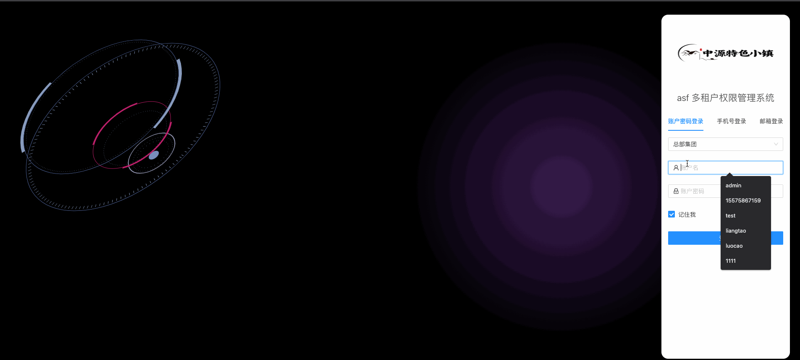
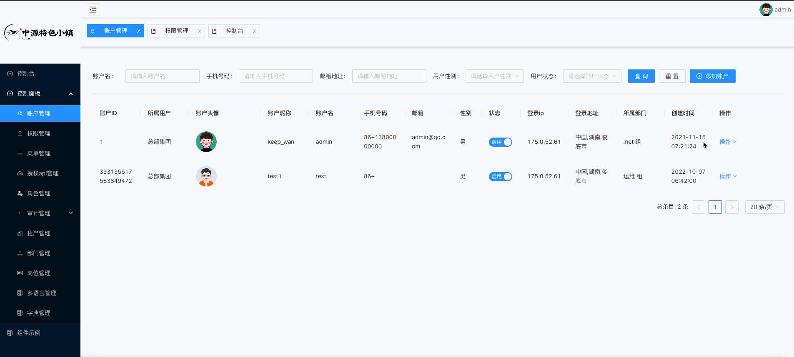
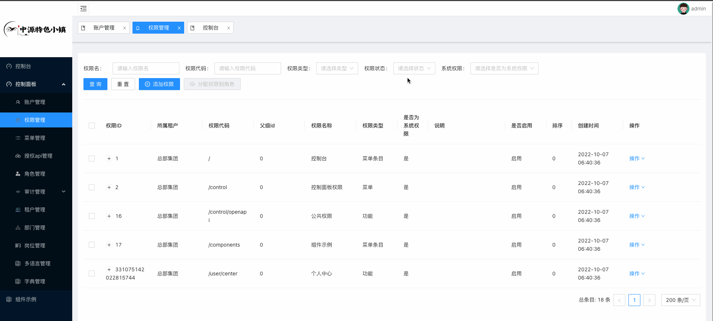
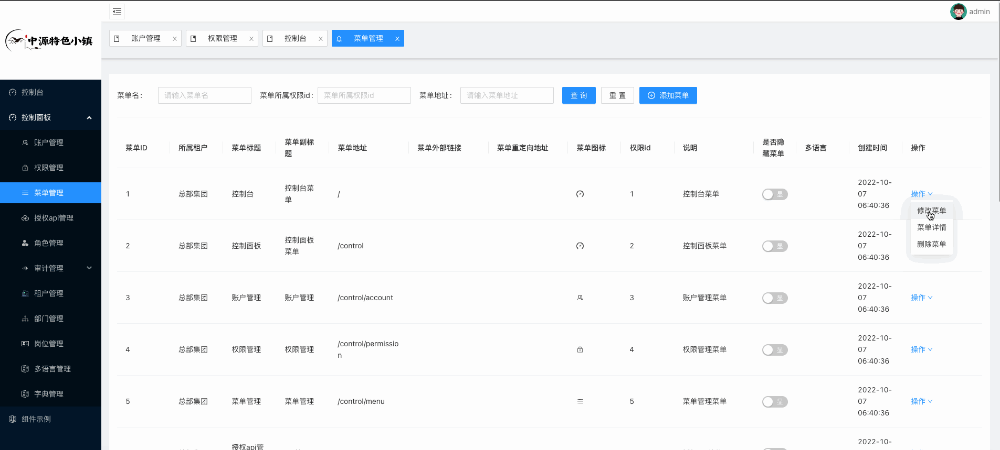
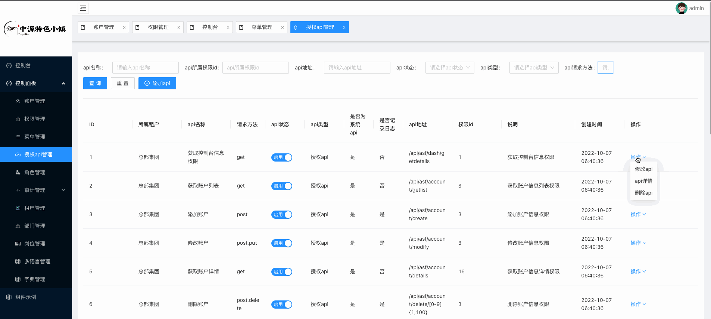
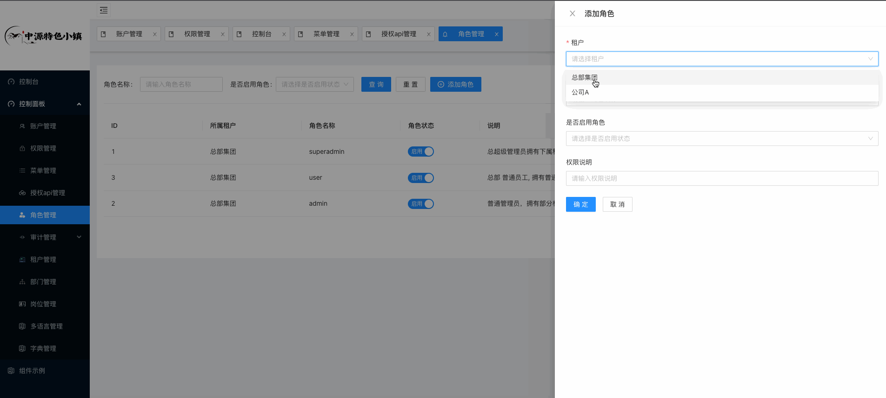
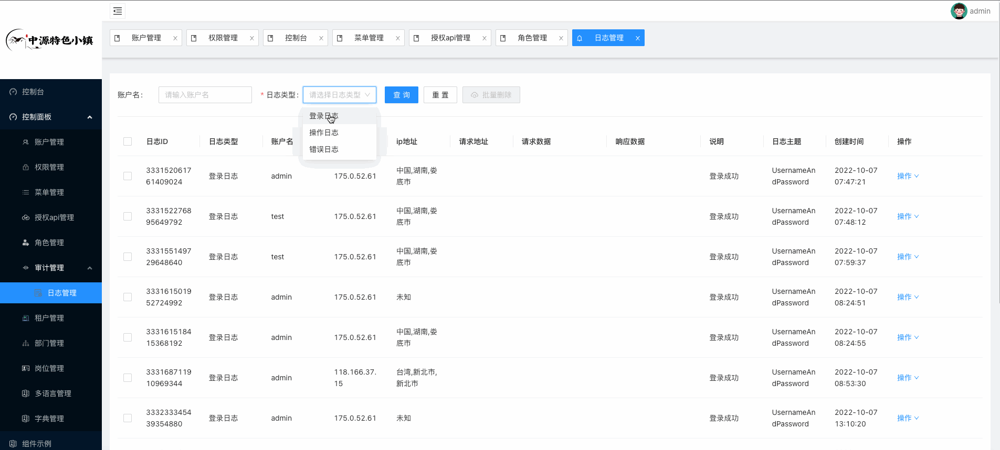
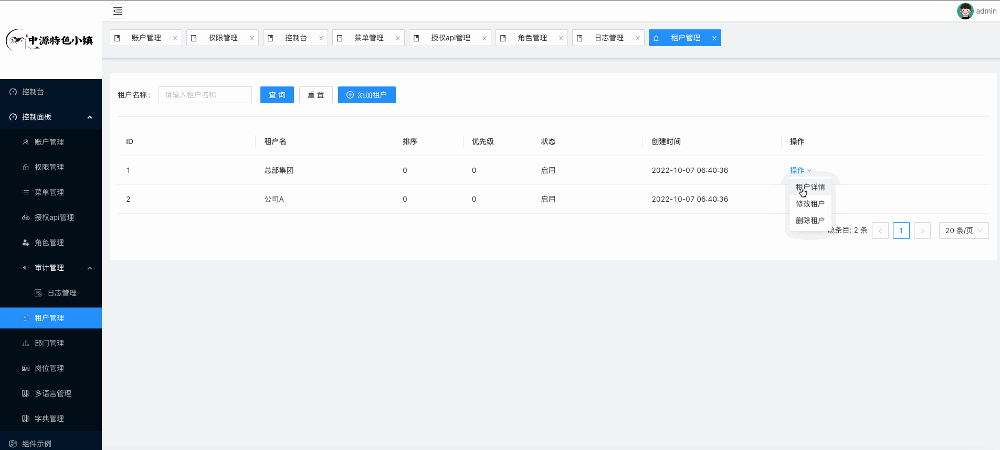
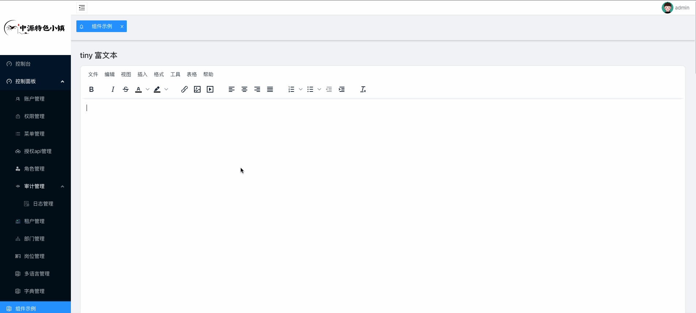

### asf 多租户集成平台 前端

##### npm 8 兼容版本 安装命令
`npm i --legacy-peer-deps`

- 支持路由权限控制
- 细分权限到按钮级别
- 使用react + antd+ redux编写
- 自定义webpack 体积更小。如果不加echarts tui tiny体积能控制在200 kb
- 封装了一些常用组件，例如echarts, tabbar. 侧边栏菜单
- 全部使用react hooks 编写, 保证组件纯洁性
- 升级 antd5, 全新写法
##### 示例图片
 
 
 

       

- react全部功能已经完成
- 下一个版本将支持angular 与 vue3
- vue3 正在开发中